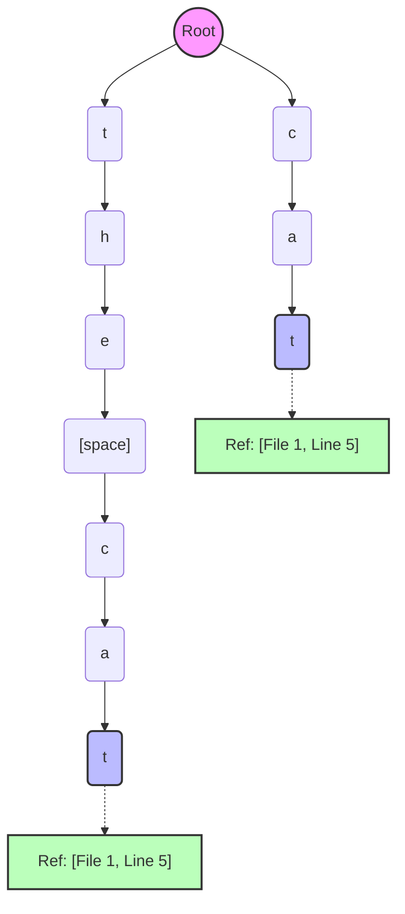

# The Word-Boundary Suffix Trie Architecture

Our auto-complete engine relies on a highly optimized, memory-efficient Suffix Trie. To index gigabytes of text without running out of RAM, the Trie implements several unique architectural rules.

## How the Trie is Built

When a sentence like `"the cat"` (located in File 1, Line 5) is fed into the Trie, it does **not** index every possible suffix (like `"he cat"`, `"e cat"`). Instead, it obeys three strict rules:
1. **Word-Boundary Indexing:** Suffixes only start at the beginning of a word (index 0, or right after a space).
2. **Depth Capping:** The suffix path stops after 15 characters (`MAX_SUFFIX_LENGTH`).
3. **Leaf-Only References:** The `SentenceMetadata` pointer is only stored at the very last node of the suffix chunk, keeping intermediate nodes perfectly lightweight.

### Visualizing: `"the cat"`
*Sentence Metadata:* File `1`, Line `5`

## How a Word is Found (The Search Process)

Let's walk through what happens when a user types the prefix `"ca"`.

### 1. Prefix Traversal & Fuzzy DFS
The search engine starts at the `Root` and traverses down the tree character by character. 
Because we allow **1 typo** (budget = 1), a recursive Depth-First Search (DFS) explores:
* The **exact** path: `Root` $\rightarrow$ `c` $\rightarrow$ `a`
* The **fuzzy** paths (e.g., replacements like `Root` $\rightarrow$ `b` $\rightarrow$ `a`, or deletions like `Root` $\rightarrow$ `c`).

### 2. Gathering References (`_gather_refs`)
When the traversal successfully reaches the node `a` (via the exact path `Root` $\rightarrow$ `c` $\rightarrow$ `a`), it checks for sentence references. 
Because of our **Leaf-Only Storage** rule, the `a` node is completely empty! 

To find the matches, the engine immediately triggers `_gather_refs()`. This microsecond-fast function dives straight down all available child paths (`a` $\rightarrow$ `t`) until it hits the leaves. Once it hits `t`, it finds and collects `Ref: [File 1, Line 5]`.

### 3. Batched Resolution & Fine Filtering
Once the DFS completes, we might have thousands of references (e.g., matching "cat", "car", "cab").
1. **Score Bucketing:** We group the references by their fuzzy score (exact matches get highest priority).
2. **Batched I/O:** We look at the highest score group, group them by `file_id`, and open the physical text files exactly once to pull out Line 5.
3. **Fine Filter:** If the user typed a very long prefix (e.g., `"the cat is running"`), which exceeds our 15-character Trie depth, we use Python's Levenshtein distance on the fully fetched string to verify it is an actual match before displaying it to the user.
